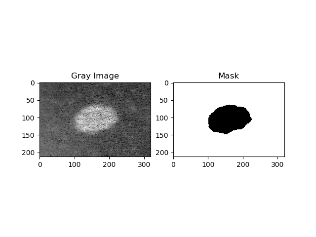
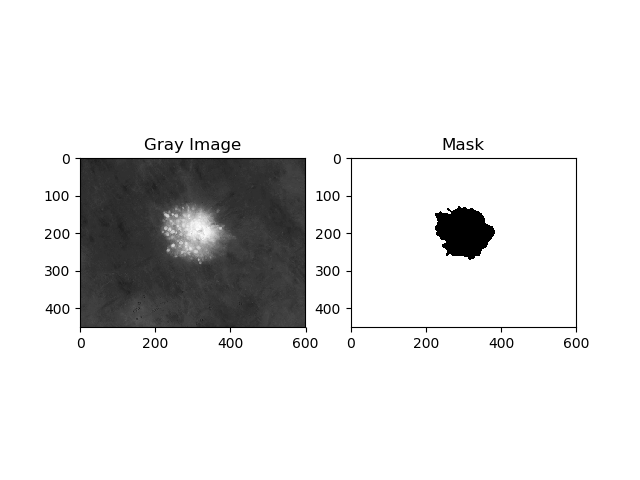

# MIC-Melanoma-Detection

# Introduction
This project is a collaboration with the Medical Innovation Club at OSU. The main goal of this project is to develop an app that will be able to use machine learning to classify melanomas. This document will cover the basic steps of image pre-processing, image segmentation, feature extraction, and training of the neural network. The data set that was used was taken from the ISIC archive (https://www.isic-archive.com/#!/topWithHeader/wideContentTop/main). 

# Running the Program
All of the pre-processing, segmentation, and feature extraction steps are handled in the preprocess.py file. The mefun.py contains the functions that are used to find the 

# Image Pre-Processing
The main goal of image pre-processing is to reduce the noise, remove unnecessary parts, and enhance the image as much as possible. The image was converted to gray scale. For noise reduction, a Gaussian blur was used. Although the Gaussian blur is not edge preserving, a small sigma value was used, which ensured that too much noise was not removed. 

# Image Segmentation
Image segmentation proved to be difficult due to the large amount of variance in images available on the data set. There are many images in the data set that have many hairs, which are difficult to remove from the image while still maintaining a sufficient amount of information in the image. Hairs were shown to skew the results of image segmentation and still prove to be an issue with the system. In order to segment the image, Otsu's method of binarization, which uses clustering-based thresholding, was used to find where the area of interest is. Noise was removed from the thresholded image by using an opening procedure, which is simply an erosion followed by a dilation. The biggest continuous contour was then found to determine the final area of interest. The resulting mask is fed into the next feature extraction steps. For a benign mole, the original image and the mask are shown below:

For a case of melanoma, the original image and the mask are shown below:

# Feature Extraction
It is clear from the above images that benign moles contain a larger variation in color distribution. It is possible to measure the color irregularity of the moles by applying a wavelet transform on an image. This process returns both spatial and temporal information about the image, making it useful in feature extraction. A decomposition level of three and the Daubechies 4 wavelet were used. The coefficient of variation of the coefficients were calculated and fed into the neural network. If there is a larger deviation in the coefficiencts, then there are larger spatial and temporal deviations in the image, indicative of the color irregularity that is present in melanomas. 

Color irregularity can be measured by using a parameter known as lacunarity. Lacunarity measures the translational invariance of an image. In the case of melanomas, large clusters of darker colors in certain regions of a mole can be thought of as a violation of translational invariance. Therefore, lacunarity may be used as a possible parameter for feature extraction and serves as a direction for future work.     

# Training the Neural Net
This is the current area of work.

# Dependencies
- numpy
- openCV
- matplotlib
- pywavelet

# Additional Resources
- Melanoma Diagnosis by the Use of Wavelet Analysis based on Morphological Operators 
